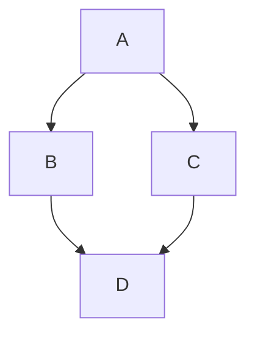

# Mandy - Simple & Free Markdown Editor


A WYSIWYG markdown editor that runs on your own machine and edits your own markdown files.

Mandy allows you to create markdown documents and export them as **fully editable HTML files** that anyone can modify and return to you. Perfect for spec-driven AI development and stakeholder reviews.

Originally forked from [Tommertom/marky](https://github.com/Tommertom/marky) and retains much of that code, mostly at conversion and rendering engine level.

Marky was where this started. Mandy is where it learned to give your files back exactly as it found them. The new name is a promise, not a coat of paint.

## What You Can Do

### Import Your Content

- **Paste from Clipboard** - **Edit → Paste markdown** loads markdown directly from your clipboard
- **Open Local Files** - Browse your computer and open any `.md`, `.markdown`, or `.txt` file directly (requires the local server, see [For Developers](#-for-developers))
- **Reload from Disk** - **File → Reload from disk** re-reads the file, picking up anything another tool, script or agent wrote to it - and it is also how you throw local changes away. Mandy checks the file whenever you come back to the window, and marks the filename `(disk changed)` when it no longer matches what you have open

### Edit with Ease

- **WYSIWYG Editing** - See your formatted text as you type, no preview pane needed
- **Formatting Toolbar** - Select any text to reveal formatting options (headings, bold, italic, lists, code blocks). Put the cursor at the start of a line with nothing selected and you get a shorter bar with just the whole-line ones - headings, lists and a code block
- **Live Updates** - Changes appear instantly as you type
- **Auto-Save** - Your work is automatically saved to your browser every second
- **Dark Mode** - Toggle between light and dark themes, or let it follow your system preference
- **Document Outline** - **View → Outline sidebar** lists the document's headings; click any of them to jump there. It follows how your headings actually nest rather than the numbers in them, so a document that uses H6 for a caption under an H1 does not draw a five-deep staircase. **Insert → Table of contents** is the related but separate thing: it writes a real linked list into the document itself - the one you want when the file is going to be read on GitHub rather than in Mandy
- **Menu Bar** - Six menus - File, Edit, Insert, Format, View and Export - hold every action; the Format menu reaches the same ten formats as the floating bar, and is the way to reach the inline ones without selecting anything
- **New and Clear** - **File → New document** starts over: blank document, no file attached, and it asks first if you have unsaved work. **Edit → Clear document** is an ordinary edit that empties the text and leaves the file you have open alone - one Ctrl+Z takes it back

### Export Your Work

- **Save to Disk** - Write your work straight back to the file you opened, with
  **File → Save As…** for anywhere else. If the file changed underneath you since you opened it,
  Mandy asks before overwriting it
- **Copy to Clipboard** - **Edit → Copy markdown** puts the rendered content on the clipboard as plain-text markdown
- **Export as HTML** - Generate a standalone, self-contained HTML page of the document alone. If the outline sidebar is open, the exported page carries a table of contents of its own
- **Export as Editable** - Generate an HTML file with the editor bundled in, so recipients can modify it directly in their browser and send it back to you. No markdown knowledge required at their end. The file is completely self-contained - one HTML file that runs entirely in the browser, with nothing to install and no sign-up - and fully capable: they can export it to markdown, PDF, DOCX or HTML, and re-export another editable copy to pass along
- **Export as PDF** - Generate professional, print-ready PDF documents with one click. Images are automatically optimized to ensure reasonable file sizes while maintaining quality
- **Export as DOCX** - Generate a Word document with headings, tables and formatting intact. Mermaid
  diagrams are embedded as images; LaTeX comes through as plain text rather than rendered math

### What You Can Format

- **Headings** (H1, H2, H3) - Organize your content with hierarchy
- **Bold & Italic** - Emphasize important text
- **Lists** - Create bullet points or numbered lists
- **Code Blocks** - Display code snippets beautifully
- **Tables** - Organize data in structured tables
- **Links & Images** - Add hyperlinks and embed images
- **Blockquotes** - Highlight quotes or important notes
- **Mermaid** diagrams
- **Latex** math formulas

### Mermaid examples



### LaTeX examples
```latex
$$\mathbb{N} = \{ a \in \mathbb{Z} : a > 0 \}$$
```

$$\mathbb{N} = \{ a \in \mathbb{Z} : a > 0 \}$$

## Keyboard Shortcuts

Make your workflow even faster:

- **Ctrl+S** (Cmd+S on Mac) - Save to the current file
- **Ctrl+Shift+S** (Cmd+Shift+S on Mac) - Save as a different file
- **Ctrl+O** (Cmd+O on Mac) - Open a markdown file
- **Ctrl+Shift+P** (Cmd+Shift+P on Mac) - Export as PDF file
- **Ctrl+Z** (Cmd+Z on Mac) - Undo
- **Ctrl+Y** or **Ctrl+Shift+Z** (Cmd+Shift+Z on Mac) - Redo

## Perfect For

- Writing README files for GitHub projects
- Creating documentation and guides
- Taking notes and writing articles
- Drafting blog posts in markdown
- Creating technical documentation
- Academic writing and research notes

## Quick Start Guide

1. **Start the server** - `npm run serve`, then open <http://localhost:9130>
2. **Open a file** - **File → Open…** and pick any markdown file on your machine
3. **Start typing** - Your content appears formatted in real-time
4. **Select text** - Use the formatting toolbar for quick styling, or put the cursor at the start of a line to restyle the whole line
5. **Save your work** - **File → Save** or press Ctrl+S to write it back to disk

That's it! No tutorials needed.

## Why Mandy?

Unlike other markdown editors:
- **Editable HTML exports** - Share documents that recipients can modify and return
- No complicated split-pane views - just pure WYSIWYG
- No account creation or login required
- Your markdown data never leaves your device

## Pro Tips

- Select any text to see the formatting toolbar appear above it
- Use **Edit → Paste markdown** to quickly load markdown from anywhere
- Your work auto-saves to localStorage - but download important files as a backup
- **File → New document** starts fresh; **Edit → Clear document** just empties the one you have open
- Toggle dark mode in the toolbar or let it automatically match your system theme
- **Collaborative HTML Workflow**: Use **Export → Editable copy…** (not **HTML page…**, which is read-only) and share the result with colleagues. They can open it in any browser, edit the content directly, save their changes, and send the modified HTML back to you. Open their file in a browser and use **Edit → Copy markdown** to get their changes back as markdown - Mandy's Open dialog only accepts `.md`, `.markdown` and `.txt`, so it cannot open the returned HTML directly.

## For Developers

### Project layout

```
front/    the editor itself — vanilla JS, no build step
server/   Deno file server: serves front/ and exposes the local file API
```

### Running locally

The server serves the editor **and** gives it read/write access to your local
markdown files, which is what the File menu's Open and Save use. Requires
[Deno](https://deno.com/).

```bash
npm run serve
```

Then open <http://localhost:9130>. Use `npm run dev` for auto-restart on
changes, or set `MANDY_PORT` to pick another port. The server binds to
`127.0.0.1` only, and the file API will read and write any `.md`, `.markdown`,
or `.txt` file your user account can reach.

If the server is not running the editor still loads — the service worker serves
it from cache — but Open, Save, Save As and Reload disable themselves, since
there is nothing to read or write through. The clipboard and the HTML/PDF/DOCX exports keep working.

### Running it permanently with pm2

[ecosystem.config.cjs](ecosystem.config.cjs) defines the process:

```bash
pm2 start ecosystem.config.cjs
```

`pm2 save && pm2 startup` will bring it back after a reboot. Two notes:

- The config is `.cjs` on purpose — `package.json` sets `"type": "module"`, and
  pm2 loads ecosystem files as CommonJS.
- It invokes `deno run` directly rather than `deno task start`, so pm2
  supervises the server itself. Going through the task wrapper means pm2 tracks
  the parent, and stop/restart can leave the real server holding the port.

If `pm2 startup` launches it at boot and it cannot find `deno`, give `script` an
absolute path (`which deno`) — the boot environment has a narrower `PATH` than
your shell.

### Tests

```bash
npm test
```

No framework and nothing to install — the suites load the real `front/` sources
into a scope with a hand-rolled DOM stub ([tests/dom.mjs](tests/dom.mjs)) and
drive them, so a suite breaks when the code it names changes. `tests/run.mjs`
runs all thirteen and exits non-zero on failure; import a suite directly to run
just that one.

They deliberately cover the things that fail **silently** — where the document
still looks right on screen and only the file on disk, or an export nobody
opened yet, is wrong:

| Suite | Holds |
| --- | --- |
| `toolbar` | Every button a variant renders has a handler in a script that variant ships, so no control is dead. |
| `format-bar` | Formatting never replaces `#editor` — the bug that left the app looking unstyled and dead until reload. |
| `latex` | The `data-tex` round trip, without which MathJax's rendered glyphs get saved over your equations. |
| `save-fidelity` | Horizontal rules stay `---` and saved files end in exactly one newline. |
| `links` | Anchor slugs, the scheme allowlist, and the Ctrl+Click hint staying out of the markdown. |
| `static-export` | What the document-only export contains, including heading anchor ids. |
| `self-reproduce` | An exported document re-exports offline, handing its successor byte-identical CSS and JS. |
| `file-path` | The open file, the last browsed directory, the `(edited)` marker surviving a reload, and Reload / the disk-changed marker against a fake disk. |
| `outline` | The depth algorithm, the inline allowlist, and the shape of the list Insert TOC writes. |
| `notify` | That no source has slipped back to `alert()`, and that dismissing a dialog is not the same as agreeing with it. |
| `undo` | The coalescing rules and, above all, that history never survives a document boundary. |
| `execcommand` | The normalisation between execCommand and the file, and the source scan that keeps `runCommand` the only call site. |
| `list-indent` | Tab and Shift+Tab in a list: the guards, and the unnesting Mandy does by hand because no engine does it right. |

Type-check the server separately with `cd server && deno task check`.

### Dependencies

There is nothing to `npm install` — which is not the same as there being no
dependencies. There is no `node_modules`, no lockfile to maintain and no build
step; `package.json` exists only to hold the `serve`, `dev` and `test` scripts.
What Mandy actually depends on is fetched at runtime instead:

**Server** — [Hono](https://hono.dev/), pinned in
[server/deno.json](server/deno.json) as `npm:hono@^4.12.23`. Deno resolves and
caches it on first run, so the first `npm run serve` on a new machine needs
network access; after that it runs from Deno's cache. Everything else the server
uses is `node:fs`, `node:path` and `node:os`.

**Frontend** — no framework, but seven libraries from CDN, version-pinned:

| Library | Loaded | For |
| --- | --- | --- |
| markdown-it 13 | eagerly | parsing markdown on the way in |
| Turndown 7 | eagerly | serialising back to markdown on the way out |
| Mermaid 11 | on first diagram | rendering fenced `mermaid` blocks |
| MathJax 3 | on first equation | rendering `$…$` / `$$…$$` |
| html2pdf 0.10 | on first PDF export | PDF |
| docx 7.1 | on first DOCX export | building the Word file |
| FileSaver 2 | on first DOCX export | handing it to the browser |

The five lazy ones load through the `ensure*` loaders in
[front/lazy-load.js](front/lazy-load.js) — Mermaid alone is 3.4 MB, so none of
them are paid for unless used. The service worker caches cross-origin URLs
cache-first (they are immutable at those versions), so after one visit the
editor boots offline; a *first* visit still needs the network.

Adding a dependency, npm or Deno, is a decision worth flagging rather than a
routine one.

Built with vanilla JavaScript and modern web standards. Check out the [GitHub repository](https://github.com/erezschatz/mandy) to:
- Report bugs or issues
- Suggest new features
- Contribute code improvements
- Fork and customize for your needs

## 📄 License

Free and open source under the MIT License.

---

**Ready to write?** `npm run serve` and open <http://localhost:9130>
