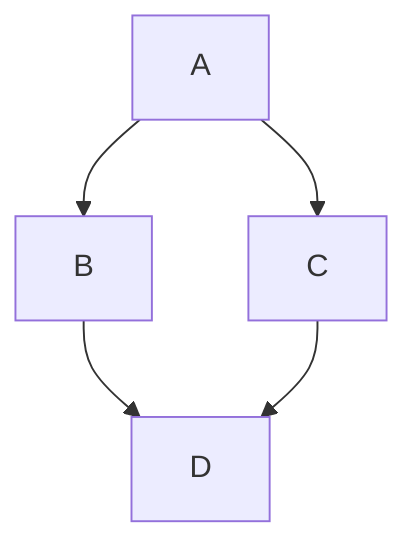

# 📝 Marky - Simple & Free Markdown Editor

A powerful WYSIWYG markdown editor that runs entirely in your browser. No installation, no sign-up required!

**The ultimate tool for collaborative document workflows.** Marky lets you create markdown documents and export them as **fully editable HTML files** that anyone can modify and return to you. Perfect for spec-driven AI development, stakeholder reviews, and collaborative editing - share HTML exports with colleagues who can edit and send back their changes as markdown.

## 🚀 Get Started

Marky runs on your own machine and edits your own files. See
[For Developers](#-for-developers) for the one command that starts it.

## ✨ What You Can Do

### 📋 Import Your Content
- **Paste from Clipboard** - Click "Paste MD" to load markdown directly from your clipboard
- **Open Local Files** - Browse your computer and open any `.md`, `.markdown`, or `.txt` file directly (requires the local server, see [For Developers](#-for-developers))

### ✏️ Edit with Ease
- **WYSIWYG Editing** - See your formatted text as you type, no preview pane needed
- **Formatting Toolbar** - Select any text to reveal formatting options (headings, bold, italic, lists, code blocks)
- **Live Updates** - Changes appear instantly as you type
- **Auto-Save** - Your work is automatically saved to your browser every second
- **Dark Mode** - Toggle between light and dark themes, or let it follow your system preference
- **Clear Document** - Start fresh with a single click

### 💾 Export Your Work
- **Save to Disk** - Write your work straight back to the file you opened, no download dance
- **Copy to Clipboard** - Instantly copy all your markdown with one click
- **Export as HTML** - Generate a standalone, self-contained HTML page of the document alone - the same kind of deliverable as PDF or DOCX, for sharing something to be read
- **Export as Editable** - Generate an HTML file with the editor bundled in, so recipients can modify it directly in their browser and send it back to you. Perfect for collaborative workflows - no markdown knowledge required at their end! The file they receive is fully capable: they can export it to markdown, PDF, DOCX or HTML, and re-export another editable copy to pass along, all without Marky installed
- **Export as PDF** - Generate professional, print-ready PDF documents with one click. Images are automatically optimized to ensure reasonable file sizes while maintaining quality
- **Export as DOCX** - Generate a Word document with headings, tables and formatting intact. Mermaid diagrams are embedded as images; LaTeX comes through as plain text rather than rendered maths

### 🎨 What You Can Format
- **Headings** (H1, H2, H3) - Organize your content with hierarchy
- **Bold & Italic** - Emphasize important text
- **Lists** - Create bullet points or numbered lists
- **Code Blocks** - Display code snippets beautifully
- **Tables** - Organize data in structured tables
- **Links & Images** - Add hyperlinks and embed images
- **Blockquotes** - Highlight quotes or important notes
- Mermaid diagrams
- Latex math formulas

### Mermain examples


### LaTeX examples
```latex
$$\mathbb{N} = \{ a \in \mathbb{Z} : a > 0 \}$$
```

$$\mathbb{N} = \{ a \in \mathbb{Z} : a > 0 \}$$

## ⌨️ Keyboard Shortcuts

Make your workflow even faster:

- **Ctrl+S** (Cmd+S on Mac) - Save to the current file
- **Ctrl+Shift+S** (Cmd+Shift+S on Mac) - Save as a different file
- **Ctrl+O** (Cmd+O on Mac) - Open a markdown file
- **Ctrl+Shift+P** (Cmd+Shift+P on Mac) - Export as PDF file
- **Ctrl+Z** (Cmd+Z on Mac) - Undo
- **Ctrl+Y** or **Ctrl+Shift+Z** (Cmd+Shift+Z on Mac) - Redo

## 🎯 Perfect For

- 📚 Writing README files for GitHub projects
- 📖 Creating documentation and guides
- 📝 Taking notes and writing articles
- ✍️ Drafting blog posts in markdown
- 📊 Creating technical documentation
- 🎓 Academic writing and research notes
- 🤖 **Collaborative Workflows** - Export as editable HTML, share with colleagues who can make changes directly in their browser, then receive their edits back as markdown
- 🔄 **Spec-Driven AI Development** - Create specs, export as editable HTML for stakeholder review and editing, receive their modified versions back, and seamlessly continue your AI development workflow

## ✨ Features

- ✅ **Editable HTML Exports** - Recipients can edit exported HTML files and send changes back
- ✅ **No Account Required** - Start using immediately
- ✅ **Installable** - Ships a web app manifest and a service worker, so you can install it and it keeps working offline once its libraries have been cached
- ✅ **No Data Sent to Servers** - No analytics, no telemetry; the only server involved is the one running on your own machine
- ✅ **Free Forever** - No subscriptions, no hidden fees
- ✅ **Open Source** - Transparent and community-driven
- ✅ **Dark Mode** - Automatic theme switching based on system preference, with manual override

## 🛠️ Quick Start Guide

1. **Start the server** - `npm run serve`, then open <http://localhost:9130>
2. **Open a file** - Click "Open" and pick any markdown file on your machine
3. **Start typing** - Your content appears formatted in real-time
4. **Select text** - Use the formatting toolbar for quick styling
5. **Save your work** - Click "Save" or press Ctrl+S to write it back to disk

That's it! No tutorials needed.

## 🌟 Why Marky?

Unlike other markdown editors:
- **Editable HTML exports** - Share documents that recipients can modify and return
- No complicated split-pane views - just pure WYSIWYG
- No account creation or login required
- Completely self-contained - one HTML file does it all
- Lightning fast - no server roundtrips
- Your markdown data never leaves your device

## 💡 Pro Tips

- Select any text to see the formatting toolbar appear above it
- Use the "Paste MD" button to quickly load markdown from anywhere
- Your work auto-saves to localStorage - but download important files as a backup
- Click "Clear" to start fresh with a new document
- Toggle dark mode in the toolbar or let it automatically match your system theme
- **Collaborative HTML Workflow**: Use **Editable** (not **HTML**, which is read-only) and share the result with colleagues. They can open it in any browser, edit the content directly, save their changes, and send the modified HTML back to you. Open their file in a browser and hit **Copy MD** to get their changes back as markdown - Marky's Open dialog only accepts `.md`, `.markdown` and `.txt`, so it cannot open the returned HTML directly.

## 🤝 For Developers

### Project layout

```
front/    the editor itself — vanilla JS, no build step
server/   Deno file server: serves front/ and exposes the local file API
```

### Running locally

The server serves the editor **and** gives it read/write access to your local
markdown files, which is what the Open/Save buttons use. Requires
[Deno](https://deno.com/).

```bash
npm run serve
```

Then open <http://localhost:9130>. Use `npm run dev` for auto-restart on
changes, or set `MARKY_PORT` to pick another port. The server binds to
`127.0.0.1` only, and the file API will read and write any `.md`, `.markdown`,
or `.txt` file your user account can reach.

If the server is not running the editor still loads — the service worker serves
it from cache — but Open and Save disable themselves, since there is nothing to
read or write through. The clipboard and the HTML/PDF/DOCX exports keep working.

### Running it permanently with pm2

[ecosystem.config.cjs](ecosystem.config.cjs) defines the process:

```bash
pm2 start ecosystem.config.cjs
```

`pm2 save && pm2 startup` will bring it back after a reboot. Two notes:

- The config is `.cjs` on purpose — `package.json` sets `"type": "module"`, and
  pm2 loads ecosystem files as CommonJS.
- It invokes `deno run` directly rather than `deno task start`, so pm2
  supervises the server itself. Going through the task wrapper means pm2 tracks
  the parent, and stop/restart can leave the real server holding the port.

If `pm2 startup` launches it at boot and it cannot find `deno`, give `script` an
absolute path (`which deno`) — the boot environment has a narrower `PATH` than
your shell.

### Dependencies

There are none to install. The frontend is vanilla JavaScript, the server uses
Deno (which fetches its own imports), and `package.json` exists only to hold the
`serve` and `dev` scripts.

Built with vanilla JavaScript and modern web standards. Check out the [GitHub repository](https://github.com/Tommertom/marky) to:
- Report bugs or issues
- Suggest new features
- Contribute code improvements
- Fork and customize for your needs

## 📄 License

Free and open source under the MIT License.

---

**Ready to write?** `npm run serve` and open <http://localhost:9130>
