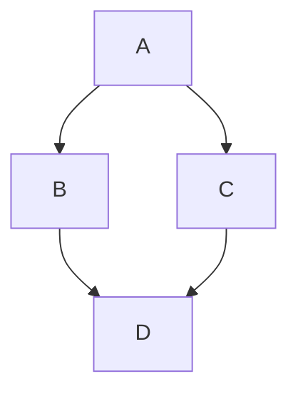

# Welcome to Mandy

A simple markdown editor that edits the files on your own machine. Start typing
and see your formatted text in real-time!

## Quick Start

**Select text** to see formatting options appear above it. Put the cursor at
the start of a line and a shorter bar appears with the formats that act on the
whole line — headings, lists and a code block. The **Format** menu always
reaches those, plus Heading 4–6 and indenting a list item, which have no room
on the smaller bar.

Everything else lives in the six menus:

- **File** — **Open…** a markdown file from your machine, **Save** straight back
  to it, or **Save As…** somewhere new. **Reload from disk** re-reads the file
  and throws your own changes away, for when something else has written to it —
  or when you want those changes gone. **New document** starts over with a blank
  one.
- **Edit** — **Undo** and **Redo**, **Copy markdown** and **Paste markdown** to
  move the whole document through the clipboard, and **Clear document**, which
  empties the text but keeps the file you have open. Undo takes it back.
- **Insert** — a **Table of contents** built from your headings, or a
  **Horizontal rule**.
- **Format** — **Paragraph** and **Heading 1**–**6**, **Bold**, **Italic**,
  **Strikethrough**, **Bullet list**, **Numbered list**, **Code block**, and
  **Indent**/**Outdent list item** for nesting a bullet without a keyboard.
- **View** — the **Outline sidebar**, which lists your headings and jumps to
  them.
- **Export** — **HTML page…**, **PDF…**, **Word document…**, and **Editable
  copy…**, which recipients can change in their browser and send back to you.

Below the menus is the file you have open. It says *(edited)* while your copy
has changes you have not saved, and *(disk changed)* when something else has
written to the file since you opened it.

## Keyboard Shortcuts

- **Ctrl+S** (Cmd+S on Mac) — Save
- **Ctrl+Shift+S** (Cmd+Shift+S on Mac) — Save as
- **Ctrl+O** (Cmd+O on Mac) — Open file
- **Ctrl+Shift+P** (Cmd+Shift+P on Mac) — Export as PDF
- **Ctrl+B** / **Ctrl+I** (Cmd+B / Cmd+I on Mac) — Bold and italic
- **Ctrl+Z** (Cmd+Z on Mac) — Undo
- **Ctrl+Y** or **Ctrl+Shift+Z** (Cmd+Shift+Z on Mac) — Redo
- **Tab** / **Shift+Tab** — Indent or unindent a bullet. Only inside a list;
  anywhere else Tab moves focus as usual.
- **Ctrl+Click** (Cmd+Click on Mac) — Follow a link, or jump to a heading it
  points at. A plain click still puts the caret in the text, so link text stays
  editable.

## Two Kinds of HTML Export

**HTML page…** gives you the document on its own: a single, standalone, styled
page, the same way PDF and Word do. That is the one you want for sharing
something to be read.

**Editable copy…** bundles the editor along with the document, so whoever opens
it can change the text in their browser and send it back. Use it when you want
edits returned, not just eyes on the page.

## LaTeX and Mermaid Support

Mandy renders LaTeX math and Mermaid diagrams. Write LaTeX with `$$...$$` for
block math or `$...$` inline. Mermaid goes in a fenced code block tagged
`mermaid`.

When exporting to DOCX, Mermaid diagrams are converted into images so they
survive the trip. LaTeX is exported as plain text — the characters come
through, but the maths is not rendered.

Sample Mermaid diagram:

Sample LaTeX math:

$$\mathbb{N} = \{ a \in \mathbb{Z} : a > 0 \}$$

**Ready to write?** **File → New document** gives you a blank one, or just start
typing.
