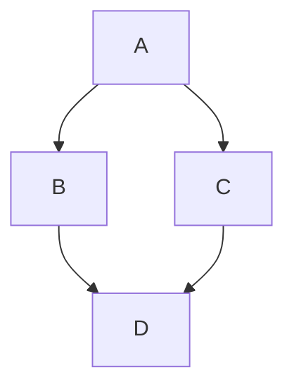

# 👋 Welcome to Marky

A simple markdown editor that edits the files on your own machine. Start typing
and see your formatted text in real-time!

## ✨ Quick Start

- **Select text** to see formatting options appear above
- **Open** — Open a markdown file from your computer
- **Save** — Write your work straight back to that file
- **Clear** — Start fresh with a blank document
- **Copy MD** / **Paste MD** — Move markdown through the clipboard
- **HTML**, **PDF**, **DOCX** — Export the document to share it
- **Editable** — Export a copy that recipients can edit in their browser and
  send back to you

## ⌨️ Keyboard Shortcuts

- **Ctrl+S** (Cmd+S on Mac) — Save
- **Ctrl+Shift+S** (Cmd+Shift+S on Mac) — Save as
- **Ctrl+O** (Cmd+O on Mac) — Open file
- **Ctrl+Shift+P** (Cmd+Shift+P on Mac) — Export as PDF
- **Ctrl+Z** (Cmd+Z on Mac) — Undo
- **Ctrl+Y** or **Ctrl+Shift+Z** (Cmd+Shift+Z on Mac) — Redo
- **Ctrl+Click** (Cmd+Click on Mac) — Follow a link, or jump to a heading it
  points at. A plain click still puts the caret in the text, so link text stays
  editable.

## 🔄 Two Kinds of HTML Export

**HTML** gives you the document on its own: a single, standalone, styled page,
the same way PDF and DOCX do. That is the one you want for sharing something to
be read.

**Editable** bundles the editor along with the document, so whoever opens it can
change the text in their browser and send it back. Use it when you want edits
returned, not just eyes on the page.

## LaTeX and Mermaid Support

Marky renders LaTeX math and Mermaid diagrams. Write LaTeX with `$$...$$` for
block math or `$...$` inline. Mermaid goes in a fenced code block tagged
`mermaid`.

When exporting to DOCX, Mermaid diagrams are converted into images so they
survive the trip. LaTeX is exported as plain text — the characters come
through, but the maths is not rendered.

Sample Mermaid diagram:

Sample LaTeX math:

$$\mathbb{N} = \{ a \in \mathbb{Z} : a > 0 \}$$

**Ready to write?** Click "Clear" to start with a blank document, or just start
typing.
